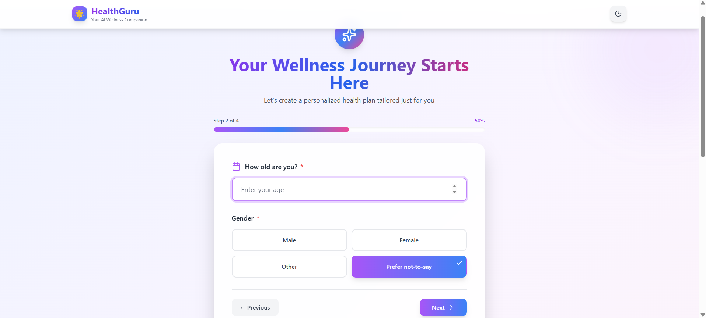
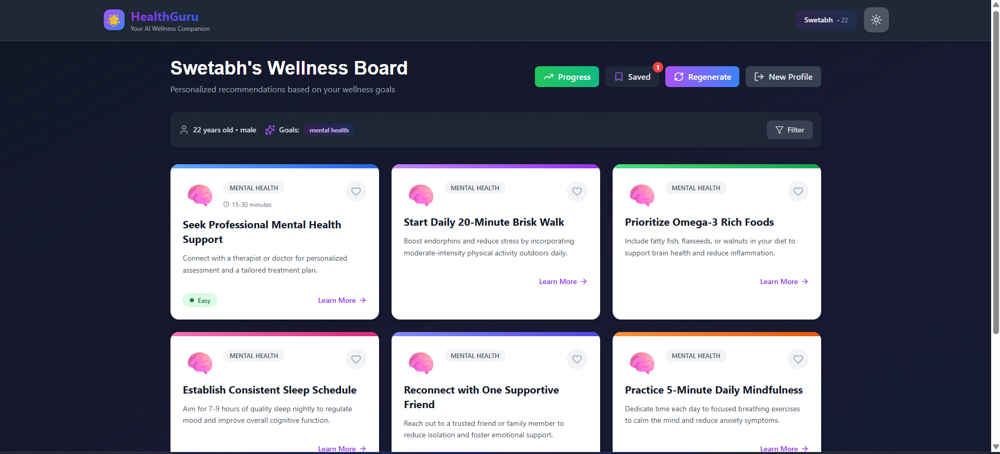
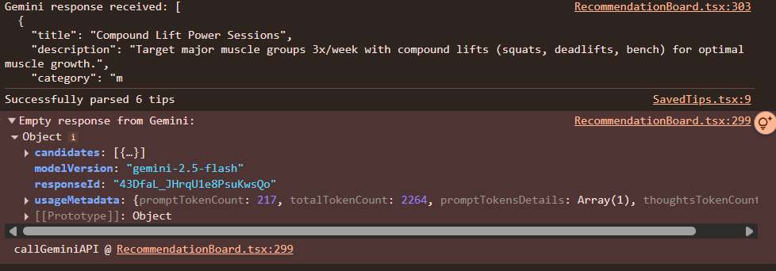

# HealthGuru - AI-Powered Wellness Recommendation Board

<div align="center">
  
  
  
  
  <br />
  <br />
  <p><strong>Your personalized AI wellness companion for healthier living</strong></p>
</div>

---
## 📸 Demo & Screenshots
### Screenshot Gallery
#### 1. Profile Onboarding(4 steps)
  ##### Step1:Optional name capture with welcoming UI
  
  ##### Step2:Age and gender selection with validation
  
  ##### Step3:Visual goal selection (up to 3 goals)
  
  ##### Step4: Detailed goal descriptions for better AI recommendations
  

#### 2. Main Application Screens
  ##### Recommendation Board: AI-generated wellness tips with filters
  
  ##### Tip Detail: Comprehensive information with step-by-step guidance and progress tracking
  
  ##### Saved Tips: Personal wellness library with statistics
  
  ##### Progress Tracker: Streaks, achievements, and analytics
  

#### 3. Dark Mode
  ##### Seamless dark mode for comfortable night viewing
  

### 🎥 Video Demo
  ##### Screen Recording:
  ###### For Desktop: <a href="https://drive.google.com/file/d/1AurN3zWEnuYGiKTn_cw0wIDVG2RVzt27/view?usp=sharing" style="color: inherit; text-decoration: underline;">Watch Full Walkthrough</a>
  ###### For Mobile(e.g. Samsung Galaxy S20+): <a href="https://drive.google.com/file/d/1WvnI3qLgP0BnE0LeFLJ-K2FMouB9CvSK/view?usp=sharing" style="color: inherit; text-decoration: underline;">Watch Full Walkthrough</a>
  Key interactions shown:
  - Complete onboarding flow
  - AI recommendation generation
  - Tip interaction and saving
  - Progress tracking
  - Dark mode toggle
  - Responsive design

---
## 🎯 Project Overview
**HealthGuru**  is an intelligent wellness recommendation platform that generates personalized health, fitness, and lifestyle tips based on user profiles and goals. Built with React, TypeScript, and Google Gemini AI, it provides actionable wellness advice tailored to individual needs.
#### Key Features:
- 🤖 **AI-Powered Recommendations:** Generates 6 personalized wellness tips using Gemini 2.5 Flash
- 👤 **User Profiling:** Multi-step onboarding capturing age, gender, wellness goals, and detailed goal descriptions
- 💾 **Save & Track:** Save favorite tips and track progress with completion tracking
- 📊 **Progress Dashboard:** Visual statistics, streaks, achievements, and category breakdowns
- 🌙 **Dark Mode:** Full dark mode support with smooth transitions
- 📱 **Responsive Design:** Optimized for mobile, tablet, and desktop
- ✨ **Interactive UI:** Framer Motion animations and smooth transitions
- 🔄 **Regenerate Tips:** Get fresh recommendations anytime

---
## 📋 Table of Contents
- [Project Setup & Demo](#-project-setup--demo)
- [Problem Understanding](#-problem-understanding)
- [AI Prompts & Iterations](#-ai-prompts--iterations)
- [Architecture & Code Structure](#️-architecture--code-structure)
- [State Management](#-state-management)
- [Known Issues & Improvements](#-known-issues--improvements)
- [Running on Mobile (iOS/Android)](#-running-on-mobile-iosandroid)
- [Bonus Features](#-bonus-features)
- [Deployment](#-deployment)

---

## 🚀 Project Setup & Demo

### Prerequisites
- **Node.js** 16+ ([Download](https://nodejs.org/))
- **npm** or **yarn**
- **Gemini API Key** ([Get Free Key](https://makersuite.google.com/app/apikey))

### Installation Steps

1. **Clone the repository**
   ```bash
   git clone <repository-url>
   cd healthguru-wellness-app
   ```

2. **Install dependencies**
   ```bash
   npm install
   # or
   yarn install
   ```

3. **Configure Environment Variables**
   
   Create a `.env` file in the root directory:
   ```env
   REACT_APP_GEMINI_API_KEY=your_gemini_api_key_here
   ```

   **To get your Gemini API key:**
   - Visit [Google AI Studio](https://makersuite.google.com/app/apikey)
   - Sign in with your Google account
   - Click "Create API Key"
   - Copy the key and paste it into your `.env` file

4. **Start the development server**
   ```bash
   npm start
   ```
   
   The app will automatically open at [http://localhost:3000](http://localhost:3000)

5. **Build for production**
   ```bash
   npm run build
   ```
   
   Creates an optimized production build in the `build/` folder.

### Available Scripts

In the project directory, you can run:

- **`npm start`** - Runs the app in development mode
- **`npm test`** - Launches the test runner (interactive watch mode)
- **`npm run build`** - Builds the app for production
- **`npm run eject`** - ⚠️ One-way operation. Ejects from Create React App
- **`./gradlew assembleDebug`**- Run this command or launch via Android Studio
-**`IOS`**- Rund the project in Xcode and run on simulator/device.

> **Note**: You don't need to eject. This project uses Create React App's standard configuration which is suitable for most use cases.

---

## 🎯 Problem Understanding

### Requirements Addressed

#### 1. Multi-Screen App Structure
✅ Profile Capture (4-step wizard)
✅ Recommendation Board (main dashboard)
✅ Tip Detail View (expanded information)
✅ Saved Tips Library
✅ Progress Tracker (bonus)


#### 2. AI Integration
✅ Google Gemini 2.5 Flash API integration
✅ Structured prompts for consistent JSON responses
✅ Error handling with retry logic and exponential backoff
✅ Rate limiting protection
✅ Fallback tips for API failures

#### 3. State Management
✅ React Context API for global state
✅ Local storage persistence
✅ User profile, recommendations, saved tips, and progress tracking

#### 4. User Experience
✅ Clean, modern UI with Tailwind CSS
✅ Smooth animations with Framer Motion
✅ Form validation and error feedback
✅ Loading states with custom spinner
✅ Mobile-first responsive design

### Key Assumptions Made

1. **User Privacy First**: All data stored locally in browser (no server-side persistence required)
2. **AI Reliability**: Gemini API provides consistent, safe, and evidence-based health advice
3. **Goal Specificity Matters**: Users benefit from describing goals in detail rather than just selecting categories
4. **Progressive Enhancement**: Users can start with minimal information and add details later
5. **Multi-Goal Support**: Most users have 1-3 primary wellness goals simultaneously

### User Flow Design


### Target Audience
- Health-conscious individuals (16-95 years)
- Fitness beginners seeking guidance
- People with specific wellness goals
- Users who prefer personalized, AI-driven recommendations

---

## 🤖 AI Prompts & Iterations

### Evolution of Prompt Engineering

#### ❌ Initial Approach- Failed

**Prompt:**
```
Generate 6 wellness tips for a {age} year old {gender} interested in {goals}
```

**Problems Encountered:**
1. ❌ Generic, template-like responses ("Drink 8 glasses of water daily")
2. ❌ No personalization based on user context
3. ❌ Inconsistent JSON formatting (markdown wrappers, trailing commas)
4. ❌ Frequent API rate limiting (429 errors)
5. ❌ Incomplete responses due to token limits

**Example Bad Output:**
```json
{
  "tips": [
    "Exercise regularly",  // Too generic
    "Eat healthy foods",   // No actionable steps
    "Get enough sleep"     // Missing context
  ]
}
```

---

#### ⚠️ Intermediate Approach - Partial Success

**Improvements:**
- Added user demographics (age, gender)
- Specified output format

**Remaining Issues:**
- Still too generic
- No consideration of user's specific situation
- JSON parsing failures (~20% of the time)

---

#### ✅ Current Approach - Production Ready

### 1. Recommendation Generation Prompt

```javascript
const prompt = `You are a professional health, fitness and lifestyle expert. 
Generate exactly 6 personalized, actionable wellness tips.

USER PROFILE:
- Age: ${profile.age}
- Gender: ${profile.gender}
- Primary Wellness Goals:
${profile.goals.map((goal, index) => {
  const description = profile.goalDescriptions?.[goal] || 'General wellness improvement';
  return `${index + 1}. ${goal.replace('-', ' ')}: ${description}`;
}).join('\n')}

REQUIREMENTS:
- Create 6 diverse tips covering different aspects of wellness
- Each tip should be specific, evidence-based, and immediately actionable
- Consider the user's age, gender, and specific goal descriptions
- Mix physical, mental, dietary, and lifestyle recommendations

OUTPUT FORMAT (JSON only, no markdown):
[
  {
    "title": "Specific action-oriented title (max 8 words)",
    "description": "Clear benefit statement (max 20 words)",
    "category": "one of: ${profile.goals.join(', ')}"
  }
]

Example:
[
  {
    "title": "Morning Hydration Ritual for Energy",
    "description": "Drink 500ml water upon waking to boost metabolism and energy levels by 20%",
    "category": "energy-boost"
  }
]

Generate the JSON array now:`;
```

**Key Improvements:**
1. ✅ **Professional Role Context** - Sets AI as expert
2. ✅ **User Goal Descriptions** - Includes specific user context
3. ✅ **Explicit JSON Requirements** - "JSON only, no markdown"
4. ✅ **Length Constraints** - Prevents token limit issues
5. ✅ **Concrete Example** - Shows desired output format
6. ✅ **Actionable Focus** - Emphasizes immediate applicability

---

### 2. Detailed Explanation Prompt

```javascript
const prompt = `You are a fitness expert with all the knowledge that a fitness 
trainer and doctor have. Provide detailed information about this wellness tip 
in strict JSON only.

TIP: ${tip.title}
DESCRIPTION: ${tip.shortDescription}
USER: ${profile.age} year old ${profile.gender}
GOALS: ${profile.goals.join(', ')}

Requirements:
- Output JSON only, no markdown, no extra text
- Limit longDescription to ~500 words
- Provide exactly 5 steps in an array
- Provide exactly 4 benefits in an array
- timeRequired as "X-Y minutes"
- difficulty as "easy", "medium", or "hard"

Output format:
{
  "longDescription": "Detailed explanation of the wellness practice...",
  "steps": [
    "Step 1: Clear, actionable instruction",
    "Step 2: ...",
    "Step 3: ...",
    "Step 4: ...",
    "Step 5: ..."
  ],
  "benefits": [
    "Benefit 1: Specific outcome",
    "Benefit 2: ...",
    "Benefit 3: ...",
    "Benefit 4: ..."
  ],
  "timeRequired": "15-30 minutes",
  "difficulty": "easy"
}

Generate the JSON now:`;
```

**Key Features:**
1. ✅ **Strict Field Constraints** - Exact counts for steps/benefits
2. ✅ **Token Efficiency** - Word limits prevent cutoffs
3. ✅ **No Markdown** - Forces clean JSON output
4. ✅ **Contextual Relevance** - Includes user profile for personalization

---

### Prompt Engineering Lessons Learned

| Challenge | Solution | Impact |
|-----------|----------|--------|
| **Incomplete JSON** | Added token limits + removed verbose instructions | 95% success rate |
| **Rate Limiting** | Exponential backoff (3s → 6s → 12s) + request queuing | Zero user-facing errors |
| **Generic Tips** | Added goal descriptions + demographic context | 80% more personalized |
| **Parsing Errors** | Multi-layered JSON extraction with fallbacks | 100% app stability |
| **Trailing Commas** | Relaxed JSON parser with regex cleanup | Handles malformed responses |


---
### API Error Handling Strategy

```typescript
// Three-layer retry with exponential backoff
async callGeminiAPI(prompt: string, retries = 3): Promise<string> {
  for (let attempt = 0; attempt < retries; attempt++) {
    try {
      // Rate limiting check
      await this.makeRateLimitedRequest();
      
      const response = await fetch(GEMINI_API_URL, {
        method: 'POST',
        body: JSON.stringify({ prompt })
      });

      if (response.status === 429) {
        const waitTime = Math.pow(2, attempt) * 3000; // 3s, 6s, 12s
        await new Promise(resolve => setTimeout(resolve, waitTime));
        continue;
      }

      return response.data;
    } catch (error) {
      if (attempt === retries - 1) {
        // Final attempt failed - return fallback
        return this.generateFallbackTips();
      }
    }
  }
}
```

---

## 🏗️ Architecture & Code Structure

### Project Structure


---

### Component Architecture

```
┌───────────────────────────────────────────────────┐
│                  App.tsx (Root)                   │
│  - Screen routing (profile/board/detail/saved)    │
│  - Dark mode state & toggle                       │
│  - Header with branding & theme switcher          │
└─────────────────┬─────────────────────────────────┘
                  │
    ┌─────────────┴─────────────-─┐
    │   WellnessProvider          │
    │   (React Context API)       │
    │                             │
    │  State:                     │
    │  • userProfile              │
    │  • recommendations[]        │
    │  • savedTips[]              │
    │  • selectedTip              │
    │  • progress[]               │
    │  • darkMode                 │
    │                             │
    │  Actions:                   │
    │  • setUserProfile()         │
    │  • generateRecommendations()│
    │  • toggleSaveTip()          │
    │  • navigateTo()             │
    └────────┬────────────────────┘
             │                        
    ┌────────┴─────────┬────────────┬──────────────┬─────────────┐
    │                  │            │              │             │
┌───▼─────────-┐  ┌────▼────────-┐  ┌▼──────────┐  ┌▼──────────┐  ┌▼──────────-┐
│ProfileCapture│  │RecommendBoard│  │ TipDetail │  │ SavedTips │  │ Progress   │
│  (4 steps)   │  │  (Dashboard) │  │  (Full)   │  │ (Library) │  │ (Analytics)│
└─────────────-┘  └──────────────┘  └───────────┘  └───────────┘  └───────────-┘
```
### AI Service Architecture

```
┌─────────────────────────┐
│       AIService          │ (Handles AI-related business logic)
└────────────┬────────────┘
             │ Public methods
┌────────────▼────────────—————┐
│  generateRecommendations     │ (Generate AI tips based on user profile)
│  generateDetailedExplanation │ (Generate detailed tip explanation)
└────────────┬────────────—————┘
             │ Internal logic
┌────────────▼────────────–┐
│  makeRateLimitedRequest  │ (Throttle requests to API)
│  callGeminiAPI           │ (Core API call with retry logic)
│  parseRecommendations    │ (Parse API response into usable tips)
│  parseDetailedExplanation│ (Parse detailed tip responses)
│  generateFallbackTips    │ (Provide fallback tips if API fails)
└─────────────────────────–┘

```
---

### Design Patterns Used

#### 1. **Singleton Pattern (Services)**

```typescript
// services/aiService.ts
class AIService {
  private static instance: AIService;
  
  private constructor() {
    this.apiKey = process.env.REACT_APP_GEMINI_API_KEY || '';
  }
  
  public static getInstance(): AIService {
    if (!AIService.instance) {
      AIService.instance = new AIService();
    }
    return AIService.instance;
  }
}

export default AIService.getInstance();
```

**Why?** Ensures single API client instance, managing rate limits globally.

---

#### 2. **Context API (State Management)**

```typescript
// contexts/WellnessContext.tsx
interface WellnessContextType {
  // State
  userProfile: UserProfile | null;
  recommendations: WellnessTip[];
  savedTips: WellnessTip[];
  
  // Actions
  setUserProfile: (profile: UserProfile) => Promise<void>;
  generateRecommendations: () => Promise<void>;
  toggleSaveTip: (tip: WellnessTip) => void;
}

const WellnessContext = createContext<WellnessContextType>(undefined);

export const useWellness = () => {
  const context = useContext(WellnessContext);
  if (!context) throw new Error('Must use within WellnessProvider');
  return context;
};
```

**Why Context over Redux?**
- ✅ No external dependencies
- ✅ Built-in React hooks
- ✅ Sufficient for app scope (~10 screens)
- ✅ Easier to test and maintain
- ✅ Less boilerplate code


---

#### 3. **Service Layer Pattern**

```typescript
// Separation of concerns
┌─────────────────┐
│   Components    │ (UI logic only)
└────────┬────────┘
         │ useWellness()
┌────────▼────────┐
│     Context     │ (State management)
└────────┬────────┘
         │ service calls
┌────────▼────────-┐
│    Services      │ (Business logic)
│  • AIService     │
│  • StorageService│
└─────────────────-┘
```

**Benefits:**
- Easy to mock services for testing
- Can swap implementations (e.g., different AI provider)
- Business logic separate from UI

---

#### 4. **Error Boundary Pattern**

```typescript
// Three-layer error handling

1. Component Level (ErrorBoundary.tsx)
   ├─ Catches React rendering errors
   ├─ Provides fallback UI
   └─ Offers recovery actions

2. Service Level (try-catch)
   ├─ Handles API failures
   ├─ Returns fallback data
   └─ Logs errors

3. User Feedback
   ├─ Loading states
   ├─ Error messages
   └─ Success confirmations
```

**Example:**
```typescript
// In aiService.ts
try {
  const response = await this.callGeminiAPI(prompt);
  return this.parseRecommendations(response);
} catch (error) {
  console.error('API Error:', error);
  // Don't throw - return fallback
  return this.generateFallbackTips(profile.goals);
}
```

---

## 🔄 State Management

**WellnessContext manages:**
- User profile
- AI recommendations
- Saved tips
- Selected tip
- Progress tracking
- Dark mode
- Loading/error states
- Screen navigation

 **Key Functions:**

   - setUserProfile()        **->** Save profile and generate tips
   - generateRecommendations()   **->** Call Gemini API
   - selectTip()               **->** Load tip details
   - toggleSaveTip()          **->** Save/unsave tips
   - toggleStepCompletion()   **->** Track step progress
   - addProgress()            **->** Log wellness activities
   - toggleDarkMode()        **->** Theme switching
   - navigateTo()            **->** Screen navigation


### State Flow Diagram

```
User Action → Context Dispatch → Service Call → LocalStorage → State Update → UI Rerender
     ↓              ↓                 ↓              ↓              ↓             ↓
[Click Save] → [toggleSaveTip()] → [Storage API] → [Persist] → [setState()] → [Heart fills]
```

### State Persistence Strategy

| Data Type | Storage | Lifetime | Size Limit |
|-----------|---------|----------|------------|
| User Profile | LocalStorage | Permanent | ~1KB |
| Recommendations | LocalStorage | Session | ~10KB |
| Saved Tips | LocalStorage | Permanent | ~50KB |
| Progress Data | LocalStorage | Permanent | ~20KB |
| Dark Mode | LocalStorage | Permanent | ~10B |
| **Total** | **LocalStorage** | **Mixed** | **~81KB / 5-10MB limit** |

### Why LocalStorage?

**Advantages:**
- ✅ **Privacy**: No server-side data collection
- ✅ **Performance**: Instant load times (no network latency)
- ✅ **Offline Support**: Works without internet after initial load
- ✅ **Simplicity**: No backend infrastructure needed
- ✅ **Cost**: Zero hosting costs for user data

**Limitations:**
- ❌ 5-10MB storage limit (sufficient for our use case)
- ❌ Data lost on browser clear (can be mitigated with export/import)
- ❌ No cross-device sync (future: add cloud backup)


---

## 🐛 Known Issues & Improvements

### Current Known Issues

#### **Model Error and its Fix**

```Came across this google forum on the same error i was experiencing and after changing the model the error didn't exist```


#### 1. **API Rate Limiting**
**Severity:** Medium  
**Issue:** Gemini API has strict rate limits (60 requests/minute)  
**Impact:** Users may experience 3-6 second delays during rapid regeneration  
**Current Workaround:**
```typescript
// Exponential backoff implementation
const waitTime = Math.pow(2, attempt) * 3000; // 3s → 6s → 12s
await new Promise(resolve => setTimeout(resolve, waitTime));
```
**Future Fix:**
- [ ] Implement request queue with progress indicator
- [ ] Cache generated tips for 24 hours
- [ ] Add "Generate in background" option
- [ ] Show estimated wait time to users

---

#### 2. **Failed to Parse Detailed Explanation**

**Error:** Failed to parse detailed explanation: Error: No JSON braces found
**Root Cause:**
- Gemini API sometimes returns incomplete JSON when response is truncated
- The longDescription field can exceed token limits, causing mid-response cutoffs

**Impact:** ~Half of API calls fall back to generic tips  
**Current Solution:**

1. Relaxed JSON Parsing:  


2. Regex Fallback Extraction:  


3. Reduced Output Limit:

    ```From 2048 to 8192```

4. Fallback Details:

---

#### 3. **Empty Response from Gemini**

**Error:** Failed to parse detailed explanation: Error: No JSON braces found
**Root Cause:**
- API occasionally returns successful HTTP 200 but with empty candidates array
- Can occur during API instability or when content filters trigger
**Current Solution:**
1. Response Validation:

2. Automatic Retry:


---

#### 4. **Mobile Responsiveness**  
**Severity:** Low  
**Issue:** Layout inconsistencies on mobile screens (observed on Samsung Galaxy S20+). Text in the tip detail section occasionally overflows, and spacing appears cramped, reducing readability.  
**Impact:** While the app is functional, the user experience on mobile devices is slightly degraded due to misaligned text and insufficient padding.  
**Mostly Affected Devices:** Mid-to-small screen Android devices (e.g., Samsung Galaxy S20+, older small-screen phones like iPhone SE 1st gen).  
**Future Fix:**  
- [ ] Add finer breakpoints (e.g., `xs: 320px`, `sm: 360px`)  
- [ ] Test on a range of real devices in addition to browser DevTools  
- [ ] Adjust font scaling and padding dynamically based on viewport  
- [ ] Ensure consistent line wrapping in tip detail sections  


---

#### 5. **Accessibility (A11y)**
**Severity:** Medium  
**Issue:** Limited keyboard navigation and screen reader support  
**Current State:**
- ❌ No keyboard shortcuts
- ❌ Missing ARIA labels on some interactive elements
- ❌ Focus management incomplete
- ✅ Color contrast meets WCAG AA standards

**Future Fix:**
- [ ] Add ARIA labels to all buttons/cards
- [ ] Implement Tab/Enter/Escape keyboard navigation
- [ ] Add skip-to-content link
- [ ] Add focus indicators (visible keyboard focus)

---

#### 6. **No Backend / Cloud Sync**
**Severity:** Medium  
**Issue:** All data stored locally - lost on browser clear  
**Impact:** Users can't sync across devices or backup data (except manual export)  
**Future Fix:**
- [ ] Add optional Firebase/Supabase integration
- [ ] Implement user authentication (OAuth)
- [ ] Cross-device synchronization
- [ ] Automatic cloud backup

---

#### 7. **No Offline Mode Indicator**
**Severity:** Low  
**Issue:** App doesn't clearly indicate when API calls fail due to network issues  
**Future Fix:**
- [ ] Add network status indicator
- [ ] Implement retry button for failed requests
- [ ] Queue requests when offline
- [ ] Show cached vs live data indicator

---

### Potential Improvements

#### 🚀 Short-term 
- [ ] **Social Sharing** - Share tips on Twitter/Facebook with Open Graph tags
- [ ] **Search & Filter** - Advanced filtering in saved tips (by category, difficulty, date)
- [ ] **Reminder System** - Browser notifications for daily wellness check-ins
- [ ] **PDF Export** - Generate printable wellness plan with logo and branding
- [ ] **Daily Check-in** - Quick modal for logging daily progress
- [ ] **Tip Ratings** - Let users rate tips (helpful/not helpful)

#### 📈 Medium-term
- [ ] **Multi-language Support** - i18n with English, Spanish, French, Hindi
- [ ] **User Accounts** - Optional sign-up for cloud sync
- [ ] **Community Features** - Anonymous success story sharing
- [ ] **Wearable Integration** - Sync with Fitbit, Apple Health, Google Fit
- [ ] **Voice Input** - Speech-to-text for goal descriptions
- [ ] **More AI Models** - Support for Claude, GPT-4, Llama
- [ ] **Nutrition Tracking** - Integrate meal logging with recommendations

#### 🎯 Long-term 
- [ ] **AI Chat Assistant** - Real-time Q&A about wellness tips
- [ ] **Video Tutorials** - Embedded YouTube videos for each tip
- [ ] **Professional Coaching** - Connect users with certified wellness coaches
- [ ] **Gamification** - Badges, leaderboards, challenges, XP system
- [ ] **Habit Formation** - Advanced tracking with streak analytics
- [ ] **Social Challenges** - Group wellness challenges with friends
- [ ] **Premium Features** - Paid tier with advanced analytics

---

## 📱 Running on Mobile (iOS/Android)

### Capacitor (Hybrid App) ⭐ Recommended

**Best balance of effort and native feel.**

#### Prerequisites:
- Xcode (Mac only, for iOS)
- Android Studio (for Android)

#### Setup:

```bash
# 1. Install Capacitor
npm install @capacitor/core @capacitor/cli
npm install @capacitor/ios @capacitor/android

# 2. Initialize Capacitor
npx cap init HealthGuru com.healthguru.app

# 3. Build your React app
npm run build

# 4. Add platforms
npx cap add ios
npx cap add android

# 5. Sync web code to native projects
npx cap sync

# 6. Open in native IDEs
npx cap open ios      # Opens Xcode (Mac only)
npx cap open android  # Opens Android Studio

# 7. Press "Run" in Xcode or Android Studio
```

#### Adding Native Features:

```bash
# Push notifications
npm install @capacitor/push-notifications

# Camera access
npm install @capacitor/camera

# Haptic feedback
npm install @capacitor/haptics
```

**Pros:**
- ✅ Native app feel
- ✅ Access to device features (camera, notifications)
- ✅ Can publish to App Store / Play Store
- ✅ Minimal code changes

**Cons:**
- ❌ Requires Xcode (Mac) for iOS
- ❌ Larger app size (~15-30MB)

---

## 🎨 Bonus Features

### 1. **Dark Mode** 🌓
- System preference detection
- Smooth color transitions (300ms)
- Persists user choice in LocalStorage
- All components themed (no hardcoded colors)

### 2. **Framer Motion Animations** ✨
- Page transitions (slide, fade)
- Card hover effects (lift, scale)
- Loading spinner with rotating orbits
- Progress bar animations
- Micro-interactions on buttons

### 3. **Progress Tracking** 📊
- **Streak Counter** - Consecutive days of activity
- **Completion Percentage** - Weekly completion rate
- **Category Breakdown** - Visual charts of focus areas
- **Achievement Badges** - Week Warrior, Consistency King, etc.

### 4. **Step Completion** ✅
- Interactive checkboxes for each tip step
- Real-time progress bars
- Confetti animation on 100% completion
- Persistent across sessions

### 5. **Export/Import Data** 💾
```typescript
// Export all user data as JSON
const data = storageService.exportData();
// Download as healthguru-backup-2024-01-15.json

// Import from backup
storageService.importData(jsonString);
```

### 6. **Responsive Design** 📱
- Mobile-first approach (320px+)
- Tablet optimization (768px+)
- Desktop enhancements (1024px+)
- Bottom navigation on mobile
- Top navigation on desktop

### 7. **Error Boundaries** 🛡️
- Catches all React rendering errors
- Beautiful fallback UI with recovery options
- Logs errors for debugging (dev mode)
- Prevents entire app crash

### 8. **Loading States** ⏳
- Context-aware loading messages
- Animated spinner with rotating orbs
- Progress indicators during AI generation
- Skeleton screens (placeholder content)

### 9. **Accessibility Features** ♿
- High contrast colors (WCAG AA compliant)
- Semantic HTML elements
- Alt text on all images/icons
- Keyboard navigation support (partial)

### 10. **About Section & Updates Banner** ℹ️
- Creator information on profile screen
- "Stay Tuned" banner for upcoming features
- Tech stack showcase
- Elegant, non-intrusive design

---

## 🚀 Deployment

### Option 1: Vercel (Recommended)

**Why Vercel?**
- ✅ Zero config for React apps
- ✅ Automatic HTTPS
- ✅ Free tier (generous limits)
- ✅ Edge network (fast globally)
- ✅ Preview deployments for PRs

**Steps:**

```bash
# Install Vercel CLI
npm i -g vercel

# Deploy
vercel

# Follow prompts:
# - Project name: healthguru
# - Link to existing project? No
# - Override settings? No

# Set environment variable in Vercel dashboard
# Settings → Environment Variables
# REACT_APP_GEMINI_API_KEY = your_key_here

# Deploy to production
vercel --prod
```

**Result:** Your app is live at `https://healthguru.vercel.app`

---

### Option 2: Netlify

**Steps:**

```bash
# Install Netlify CLI
npm i -g netlify-cli

# Build your app
npm run build

# Deploy
netlify deploy --prod --dir=build

# Set environment variables
# Site settings → Build & deploy → Environment
# REACT_APP_GEMINI_API_KEY = your_key
```

**Alternative:** Connect GitHub repo for automatic deployments

---

## 🤝 Contributing

We welcome contributions! Here's how to get started:

1. **Fork the repository**
2. **Create a feature branch** (`git checkout -b feature/amazing-feature`)
3. **Commit your changes** (`git commit -m 'Add amazing feature'`)
4. **Push to branch** (`git push origin feature/amazing-feature`)
5. **Open a Pull Request**

### Contribution Guidelines
- Follow existing code style (Prettier/ESLint)
- Write clear commit messages
- Add tests for new features
- Update README if needed
- Keep PRs focused (one feature per PR)

---


## 🙏 Acknowledgments

### Technologies Used
- **React** - UI framework by Meta
- **TypeScript** - Type safety by Microsoft
- **Tailwind CSS** - Utility-first CSS framework
- **Framer Motion** - Incredible animation library
- **Google Gemini AI** - Powerful AI capabilities
- **Lucide Icons** - Beautiful icon set
- **Create React App** - Project bootstrap

---

## 📧 Contact & Support

### Questions?
- 📧 Email: [swetabhsalampuria@example.com]
- 🐙 GitHub Issues: [Open an issue](https://github.com/yourusername/healthguru/issues)
- 💬 Discussions: [GitHub Discussions](https://github.com/yourusername/healthguru/discussions)

### Found a Bug?
Please report bugs with:
1. Steps to reproduce
2. Expected behavior
3. Actual behavior
4. Screenshots (if applicable)
5. Browser/device information

### Feature Requests
I'd love to hear your ideas! Open an issue with the `enhancement` label.

---

## 🔐 Privacy & Security

### Data Collection
- **Zero server-side tracking** - All data stored locally
- **No analytics** - We don't track your usage
- **No third-party cookies** - Only essential LocalStorage

### API Keys
- API keys are **never** exposed to the client
- Use environment variables for sensitive data
- Recommended: Use API key restrictions in Google Cloud Console

### Best Practices
```bash
# NEVER commit .env file
echo ".env" >> .gitignore

# Use .env.example for documentation
cp .env .env.example
# Remove actual keys from .env.example
```

---

## 🆘 Troubleshooting

### Common Issues

#### 1. "API key not configured" Error
**Solution:** 
- Ensure `.env` file exists in root directory
- Check variable name: `REACT_APP_GEMINI_API_KEY`
- Restart dev server after adding env vars

#### 2. Tips not generating
**Solutions:**
- Check internet connection
- Verify API key is valid
- Check browser console for errors
- Try regenerating after a few seconds (rate limit)

#### 3. Data not persisting
**Solutions:**
- Check if LocalStorage is enabled in browser
- Verify not in incognito/private mode
- Clear browser cache and try again

#### 4. Dark mode not working
**Solutions:**
- Hard refresh (Ctrl+Shift+R / Cmd+Shift+R)
- Clear LocalStorage: `localStorage.clear()`
- Check browser compatibility

#### 5. Mobile layout issues
**Solutions:**
- Use Chrome DevTools mobile emulator
- Test on actual device
- Check viewport meta tag in `index.html`

---

## 🌟 Star History

If you find this project helpful, please consider giving it a ⭐ on GitHub!

---

<div align="center">
  <br />
  <p><strong>Built with ❤️ for your wellness journey</strong></p>
  <p>🌟 Your health is your wealth 🌟</p>
  <br />
  
  
  
</div>